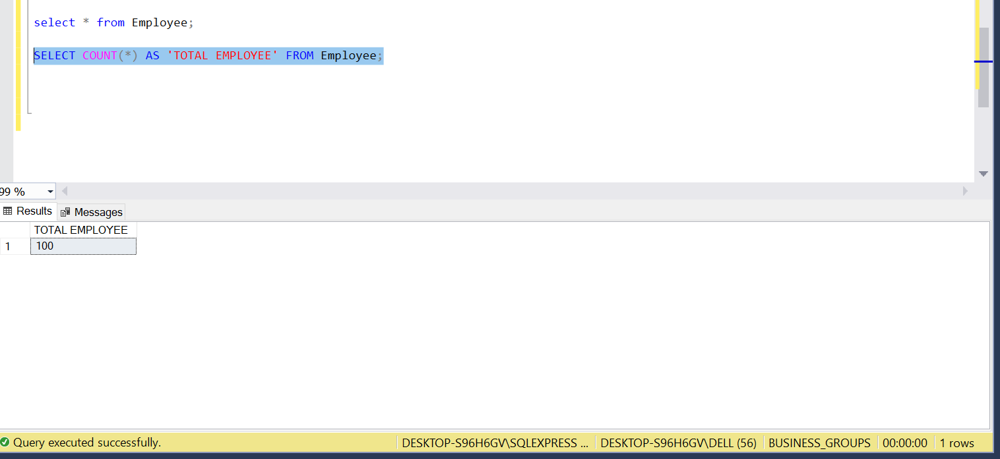
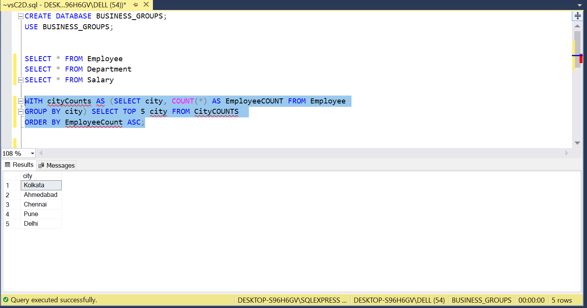
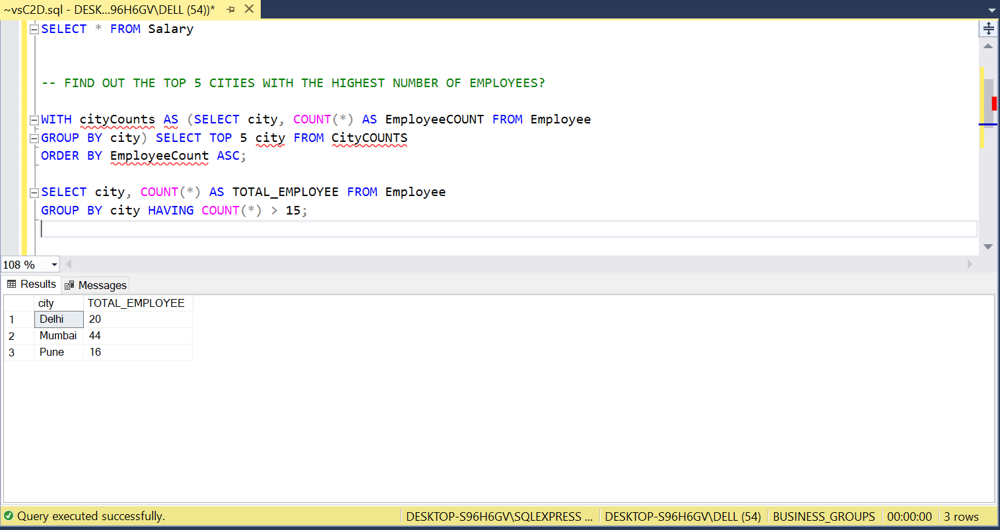
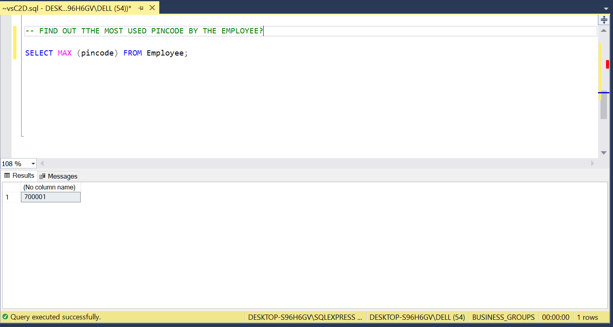

# SQL TASK THREE

## INTRODUCTION

This is a sequel of the preivous Datasets used due to some unanswered business questions. 
This analysis is to drive and compare the company's fundamental business to companies
in the same industry for various financial roles, more attention to specific developments
of the employees and help the company to make imformed decision in the future.
**_Disclaimer**_ : all datasets and reports do not represent any company , institution or country,
just an ordinary datasets to be used for tasks and assignments.

## DATASET

I was provided with the datasets and they consist of files in comma seperated values(CSV) format.
- Employee
- Salary
- Department

## CASE STUDY

1. What is the total number of employees in our employee table.
2. Find out the top 5 cities with the highest number of employees.
then filter the result to show cities with more than 15 employees.
3. Find out the most used pin code by the employee. In this case,
we want to know the pin codes that is used the most.

## CONCEPTS DEMONSTARTED

The following were incoporated-

- COUNT(*)
- SELECT
- ORDER BY
- FROM
- HAVING
- GROUP BY
- MAX

## SOLUTION 

### 1.WHAT IS THE TOTAL NUMBER OF EMPLOYEES IN OUR EMPLOYEE TABLE.

I selected using this syntax 
SELECT * FROM Employee
SELECT * FROM Department
SELECT * FROM Salary
SELECT COUNT(*) AS TOTAL_EMPLOYEE FROM Employee; The result is displayed in the screenshot.

---

### 2. Find out the top 5 cities with the highest number of employees then filter the result to show cities with more than 15 employees.

The Syntax for this question;
WITH cityCounts AS (SELECT city, COUNT(*) AS EmployeeCOUNT FROM Employee
GROUP BY city) SELECT TOP 5 city FROM CityCOUNTS 
ORDER BY EmployeeCount ASC;
SELECT city, COUNT(*) AS TOTAL_EMPLOYEE FROM Employee
GROUP BY city HAVING COUNT > 15; The result is displayed in the screenshot.

TOP 5 CITIES         >15 EMPLOYEES
:----------------:|:------------------:
   |  
---

### 3. Find out the most used pin code by the employee. In this case,we want to know the pin codes that is used the most.

Syntax: SELECT MAX (pincode) FROM Employee. The result is displayed in the screenshot.

---

# CONCLUSION
I DID IT!!!!!

**_THE END_**
